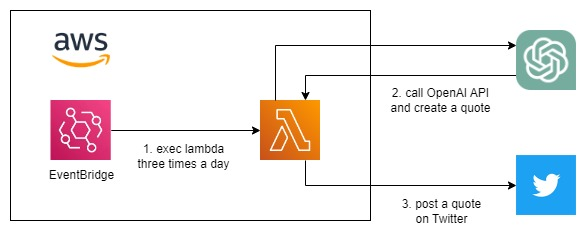

# About this repository
This repository contains the codebase for an AWS Lambda function.  
The aim of the function is to generate a quote using OpenAI API and post it on Twitter.  
The ChatGPT3.5 model takes on the persona of a great historical figure and creates quotes that inspire and uplift those facing hardship.

## Architecture
I have configured AWS EventBridge to trigger the Lambda function three times a day,  
resulting in the following architecture:



## Twitter Account
Here is the actual Twitter account:  
https://twitter.com/great_chatgpt

## Build file for Lambda
You need to create an executable file and compress it into a zip format for Lambda.
```sh
# build
GOOS=linux go build -o main

# zip (windows)
powershell -c Compress-Archive -Path "./main" -DestinationPath function.zip
```

## Environment Variables
The following environment variables are required:

- OPEN_AI_API_KEY=${your openai api key}
- GOTWI_API_KEY=${your twitter api key}
- GOTWI_API_KEY_SECRET=${your twitter api key secret}
- GOTWI_ACCESS_TOKEN=${your twitter access token}
- GOTWI_ACCESS_TOKEN_SECRET=${your twitter access token secret}
